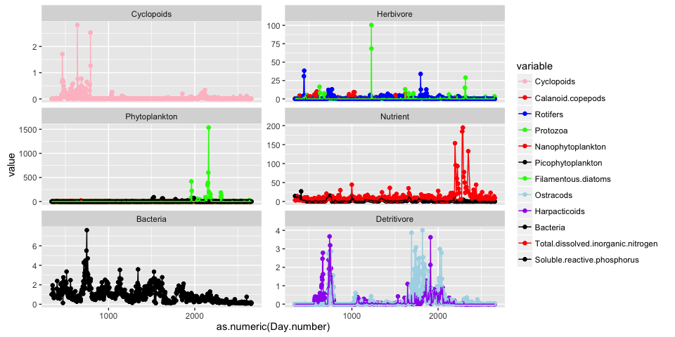
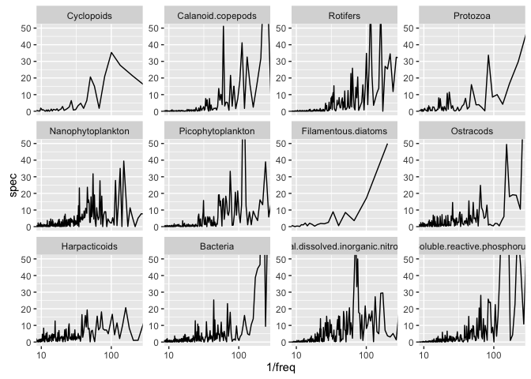
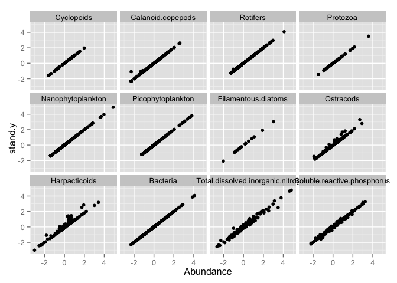
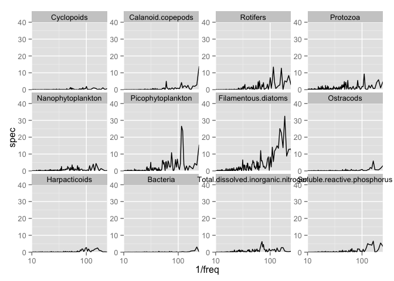
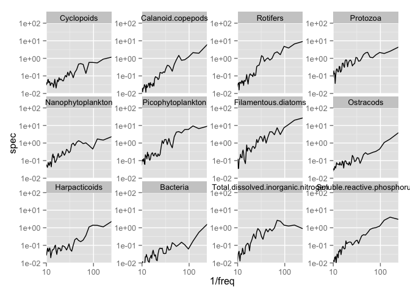
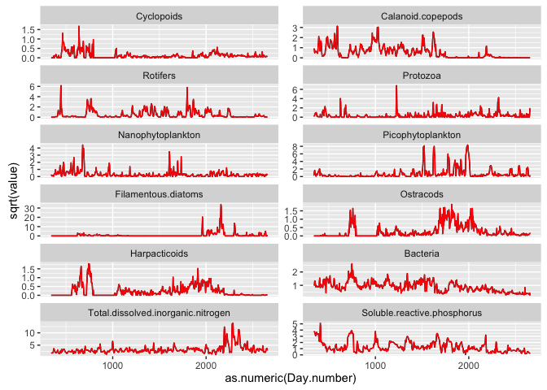
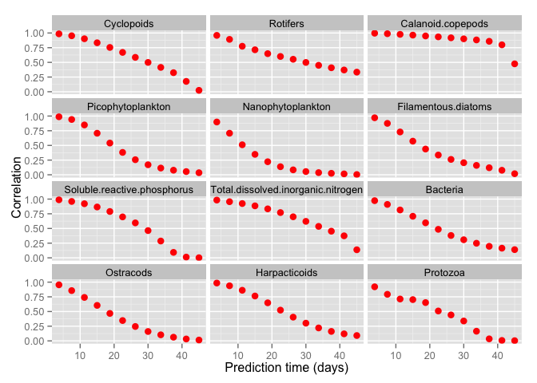
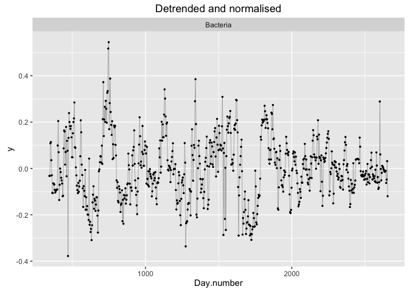

# Reproduce anaylses of Beninca et al (2008)
Owen Petchey et al  
29 Jan 2015  

# Introduction

This document contains various reproductions of the anaylses presented in the paper *Chaos in a long-term experiment with a plankton community*, by Elisa Benincà and others ([the paper on the Nature website](http://www.nature.com/nature/journal/v451/n7180/abs/nature06512.html)). Details of the methods are in [the Supplement to the Nature paper](http://www.nature.com/nature/journal/v451/n7180/extref/nature06512-s1.pdf).

This reproduction was made as part of the Reproducible Research in Ecology, Evolution, Behaviour, and Environmental Studies (RREEBES) Course, lead by Owen Petchey at the University of Zurich. More information about the course [here](https://github.com/opetchey/RREEBES/blob/master/README.md) on github.

*Update* The code and data for the reproduction are [here](https://github.com/opetchey/RREEBES/tree/Beninca_development) on github.

# Authors

Lead author was Owen Petchey. Frank Pennekamp and Marco Plebani made sizeable contributions. All contributors are detailed on github in the commit history etc.

# Known issues

The known issues / problems with this reproduction are with the prefix "Beninca" [here](https://github.com/opetchey/RREEBES/issues). Please add and or solve issues there.

# The data

The data are available as an Excel file supplement to [an Ecology Letters publication](http://onlinelibrary.wiley.com/doi/10.1111/j.1461-0248.2009.01391.x/abstract). The Excel file contains several datasheets. Two are particularly important, as they are the source of the raw data (one contains original species abundances, the one with the nutrient concentrations). Another datasheet in the ELE supplement contains transformed variables. We also got some data direct from Steve Ellner, see below for details.

In the code below, the data and any other files are read from github, which means there must be a connection to github.

# R session info


```r
rm(list=ls())
devtools::session_info()
```

```
## Session info --------------------------------------------------------------
```

```
##  setting  value                       
##  version  R version 3.2.2 (2015-08-14)
##  system   x86_64, darwin13.4.0        
##  ui       X11                         
##  language (EN)                        
##  collate  en_US.UTF-8                 
##  tz       Europe/Zurich               
##  date     2015-10-20
```

```
## Packages ------------------------------------------------------------------
```

```
##  package   * version date       source        
##  devtools    1.9.1   2015-09-11 CRAN (R 3.2.0)
##  digest      0.6.8   2014-12-31 CRAN (R 3.2.0)
##  evaluate    0.8     2015-09-18 CRAN (R 3.2.0)
##  formatR     1.2.1   2015-09-18 CRAN (R 3.2.0)
##  htmltools   0.2.6   2014-09-08 CRAN (R 3.2.0)
##  knitr       1.11    2015-08-14 CRAN (R 3.2.2)
##  magrittr    1.5     2014-11-22 CRAN (R 3.2.0)
##  memoise     0.2.1   2014-04-22 CRAN (R 3.2.0)
##  rmarkdown   0.8.1   2015-10-10 CRAN (R 3.2.2)
##  stringi     0.5-5   2015-06-29 CRAN (R 3.2.0)
##  stringr     1.0.0   2015-04-30 CRAN (R 3.2.0)
##  yaml        2.1.13  2014-06-12 CRAN (R 3.2.0)
```

# Repository to read data from

The datasets are read from this github repository:

```r
repo <- "https://raw.githubusercontent.com/opetchey/ReScience-submission/beninca_dev"
```


# First get the raw data into R, and clean and tidy it.

All required libraries:


```r
library(tidyr)
library(dplyr)
library(lubridate)
library(stringr)
library(ggplot2)
library(RCurl)
library(pracma)
library(oce)
library(tseriesChaos)
library(reshape2)
library(mgcv)
library(repmis)

spp.abund <- read.csv(text=getURL(paste0(repo,"/data/species_abundances_original.csv")), skip=7, header=T)

spp.abund <- select(spp.abund, -X, -X.1)
spp.abund <- spp.abund[-804:-920,]
str(spp.abund)
```

```
## 'data.frame':	803 obs. of  12 variables:
##  $ Date               : Factor w/ 803 levels "","01/02/91",..: 306 440 465 498 520 601 628 673 699 778 ...
##  $ Day.number         : int  1 6 7 8 9 12 13 15 16 19 ...
##  $ Cyclopoids         : num  0 0 0.0353 0 0.0353 ...
##  $ Calanoid.copepods  : num  1.04 2.03 1.72 2.41 1.71 ...
##  $ Rotifers           : num  7.7 10.19 8.08 6.06 5.94 ...
##  $ Protozoa           : Factor w/ 330 levels "","0","0,000001",..: 1 1 1 1 1 1 1 1 1 1 ...
##  $ Nanophytoplankton  : num  0.106 0.212 0.212 0.212 0.212 ...
##  $ Picophytoplankton  : num  1 2 1.52 1.52 1.98 ...
##  $ Filamentous.diatoms: num  0 0 0 0 0 0 0 0 0 0 ...
##  $ Ostracods          : num  0 0 0 0.0187 0 ...
##  $ Harpacticoids      : num  0 0 0 0 0 0 0 0 0 0 ...
##  $ Bacteria           : num  2.15 1.97 1.79 1.61 1.43 ...
```

The Protozoa variable contains some numbers with comman as the decimal separator. This creates a question about what dataset was used for the original analyses, as it could not have been this one.


```r
spp.abund$Protozoa <- as.numeric(str_replace(spp.abund$Protozoa, ",", "."))
```

Format the dates as dates


```r
spp.abund$Date <- dmy(spp.abund$Date)
```

Ooops... R assumes the experiment was done in the 21st century. Shouldn't matter too much.

Check dates match the Day.number (should give true):

```r
sum(spp.abund$Day.number == 1+as.numeric((spp.abund$Date - spp.abund$Date[1]) / 24 / 60 / 60)) == length(spp.abund$Date)
```

```
## [1] TRUE
```

Check for duplicate dates:

```r
spp.abund$Date[duplicated(spp.abund$Date)]
```

```
## [1] "2096-10-28 UTC"
```

```r
which(duplicated(spp.abund$Date))
```

```
## [1] 702
```

Original dataset contains a duplicated date: 28/10/1996 (row 709 and 710 in excel sheet). Lets change the date in row 709 to 26/10/1996, which will put it half way between the two surrounding dates:


```r
which(spp.abund$Date==ymd("2096-10-28 UTC"))
```

```
## [1] 701 702
```

```r
spp.abund$Date[701] <- ymd("2096-10-26 UTC")
```

Check dates match the Day.number (should give true):

```r
sum(spp.abund$Day.number == 1+as.numeric((spp.abund$Date - spp.abund$Date[1]) / 24 / 60 / 60)) == length(spp.abund$Date)
```

```
## [1] FALSE
```

Fix the Day.number problem:

```r
spp.abund$Day.number <- 1+as.numeric((spp.abund$Date - spp.abund$Date[1]) / 24 / 60 / 60)
```

Data is in wide format, so change it to long:

```r
spp.abund <- gather(spp.abund, "variable", "value", 3:12)
str(spp.abund)
```

```
## 'data.frame':	8030 obs. of  4 variables:
##  $ Date      : POSIXct, format: "2090-07-12" "2090-07-17" ...
##  $ Day.number: num  1 6 7 8 9 12 13 15 16 19 ...
##  $ variable  : Factor w/ 10 levels "Cyclopoids","Calanoid.copepods",..: 1 1 1 1 1 1 1 1 1 1 ...
##  $ value     : num  0 0 0.0353 0 0.0353 ...
```

Bring in the nutrient data:

```r
nuts <- read.csv(text=getURL(paste0(repo,"/data/nutrients_original.csv")), skip=7, header=T)
#nuts <- read.csv("~/Dropbox (Dept of Geography)/RREEBES/Beninca_etal_2008_Nature/data/nutrients_original.csv", skip=7, header=T)

nuts <- select(nuts, -X, -X.1)
nuts <- nuts[-349:-8163,]
nuts$Date <- dmy(nuts$Date)
nuts <- select(nuts, -NO2, -NO3, -NH4)
#nuts$Date[duplicated(nuts$Date)]
#which(duplicated(nuts$Date))
nuts <- gather(nuts, "variable", "value", 3:4)
str(nuts)
```

```
## 'data.frame':	696 obs. of  4 variables:
##  $ Date      : POSIXct, format: "2090-09-18" "2090-09-24" ...
##  $ Day.number: int  69 75 82 90 96 103 110 117 124 131 ...
##  $ variable  : Factor w/ 2 levels "Total.dissolved.inorganic.nitrogen",..: 1 1 1 1 1 1 1 1 1 1 ...
##  $ value     : num  28.32 20.84 11.15 15.5 5.92 ...
```

Now put the two datasets together

```r
all.data <- rbind(spp.abund, nuts)
```

Now select only the date range used in the Nature paper. From the supplment *The analysis in Benincà et al. (Nature 2008) covered all data from 16/06/1991 until 20/10/1997*. (Remembering dates in the R dataframes are 2090s.)

```r
all.data <- filter(all.data, Date>=dmy("15/06/2091") & Date<=dmy("21/10/2097"))

#all.data[all.data$Date==dmy("16/06/2091"),]
#all.data[all.data$Date==dmy("20/10/2097"),]
```

# Reproducing figure 1b through 1g

(No attempt to reproduce Figure 1a, as its a food web diagram.)

First add a column that gives the variable types, same as in figure 1b through 1g. Make a table giving species type:

```r
tt <- data.frame(variable=unique(all.data$variable),
                 Type=c("Cyclopoids", "Herbivore", "Herbivore", "Herbivore",
                        "Phytoplankton",  "Phytoplankton", "Phytoplankton",
                        "Detritivore", "Detritivore", "Bacteria", "Nutrient", "Nutrient"))
#tt
```

And add the Type variable to the new dataset:

```r
all.data <- merge(all.data, tt)
```

First lets set the colours as in the original:

```r
species.colour.mapping <- c("Cyclopoids"="pink",
                            "Calanoid.copepods"="red",
                            "Rotifers"="blue",
                            "Protozoa"="green",
                            "Nanophytoplankton"="red",
                            "Picophytoplankton"="black",
                            "Filamentous.diatoms"="green",
                            "Ostracods"="lightblue",
                            "Harpacticoids"="purple",
                            "Bacteria"="black",
                            "Total.dissolved.inorganic.nitrogen"="red",
                            "Soluble.reactive.phosphorus"="black")                            
```

Next change the order of the levels in the Type variable, so plots appear in the same order as in the original figure:

```r
all.data$Type <- factor(all.data$Type, levels=c("Cyclopoids", "Herbivore", "Phytoplankton", "Nutrient",
                                    "Bacteria", "Detritivore"))
```

<!--
Here are some versions of the graphs that are not included in the report, hence the html comment:

Now a version that doesn't try to recreate the "gap" in the y axes of the original figures:

```r
g1 <- qplot(as.numeric(Day.number), value, col=variable, data=all.data) +
  facet_wrap(~Type, ncol=2, scales="free_y") +
  geom_point() + geom_line() +
  scale_colour_manual(values = species.colour.mapping)
g1
```

 
Looks reasonably good.

Now a version that approximates the "gap", by removing data above it:

```r
an2 <- filter(all.data, Type=="Cyclopoids" & value<0.6 |
                Type=="Herbivore" & value<13 |
                Type=="Phytoplankton" & value<1400 |
                Type=="Nutrient" & value<50 |
                Type=="Bacteria" & value<10 |
                Type=="Detritivore" & value<0.7) 
g1 <- qplot(as.numeric(Day.number), value, col=variable, data=an2) +
  facet_wrap(~Type, ncol=2, scales="free_y") +
  geom_point() + geom_line() +
  scale_colour_manual(values = species.colour.mapping)
g1
```

 
Difficult it look like the data go off the top of the graph in ggplot.

Try logarithmic y-axes:

```r
g1 <- qplot(as.numeric(Day.number), log10(value+0.00001), col=variable, data=all.data) +
  facet_wrap(~Type, ncol=2, scales="free_y") +
  geom_point() + geom_line() +
  scale_colour_manual(values = species.colour.mapping)
g1
```

 

End of html comment
-->

The graph with abundances fourth root transformed, as this is the transformation used in the ms.


```r
g1 <- ggplot(aes(x=as.numeric(Day.number), y=value^0.25, col=variable), data=all.data) +
  xlab("Time (days)") + ylab("Abundance value ^ 0.25") +
  facet_wrap(~Type, ncol=2, scales="free_y") +
  geom_line() +
  scale_colour_manual(values = species.colour.mapping)
g1
```

 

# Data transformation

Now we need to work with transformed data. Details of the transformation, copied from the Supplmentary information are in indented quote style in the following sections... looks like this:

> 3. Transformation of the time series. We transformed the original time series, shown in Fig. 1b-g of the main text, to obtain stationary time series with equidistant data and homogeneous units of measurement. The transformation steps are illustrated for the bacteria (Fig. S1).

Aside: The ELE supplement contains the raw data and the transformed data, in separate data sheets. I (Owen) also got the interpolated data from Stephen Ellner directly.

## Interpolation

> First, the time series were interpolated using cubic hermite interpolation, to obtain data with equidistant time intervals of 3.35 days (Fig. S1a).

Make a sequence of times at which to interpolate. 


```r
#aggregate(Day.number ~ variable, all.data, min)
#aggregate(Day.number ~ variable, all.data, max)
#xout <- seq(343.35, 2657.2, by=3.35)
xout <- seq(343.35, 2658, by=3.35)
#range(xout)
```

Perform the interpolation:

```r
all.data1 <- na.omit(all.data)
mt <- plyr::dlply(all.data1,
                  "variable",
                  function(xx) pracma::interp1(x=xx$Day.number,
                                               y=xx$value,
                                               xi=xout,
                                               method="cubic"))
## Aside: the duplicated date that was previously fixed was only discovered by a warning message
## given by the pracma::interp1 function!

mt <- as.data.frame(mt)
mt <- cbind(Day.number=xout, mt)
mt <- gather(mt, variable, value, 2:13)
```

Check this against the data direct from Steve:


```r
from.steve <- read.csv(text=getURL(paste0(repo,"/data/interp_short_allsystem_newnames.csv")), header=T)

from.steve <- gather(from.steve, Species, Abundance, 2:13)

names(from.steve) <- c("Day.number", "variable", "value")

g1 <- ggplot(mt, aes(x=as.numeric(Day.number), y=value)) +
  facet_wrap(~variable, ncol=2, scales="free_y") +
  geom_line(size=0.5, col="black") +
  scale_colour_manual(values = species.colour.mapping)
g2 <- geom_line(data=from.steve, aes(x=Day.number, y=value), col="red")
g1 + g2
```

 

Looks very good.


## Fourth root transform

> Next, because the original time series showed many sharp spikes, the time series were rescaled using a fourth-root power transformation (Fig. S1b). The sharp spikes bias "direct method" estimates of the Lyapunov exponent, because nearby pairs of reconstructed state vectors mostly occurred in the troughs between spikes. The average rate of subsequent trajectory divergence from these pairs is therefore an estimate of the local Lyapunov exponent in the troughs, which may be very different from the global Lyapunov exponent. By making spikes and troughs more nearly symmetric, the power transformation resulted in a much more even spread of nearby state vector pairs across the full range of the data for all functional groups in the food web. The transformation is also useful for fitting nonlinear models of the deterministic skeleton (used for nonlinear predictability and indirect method estimates of the Lyapunov exponent), which was done by least squares and therefore is most efficient when error variances are stabilized. Fourth-root transformation is intermediate between the square-root transformation that would approximately stabilize the measurement error variance in count data from random subsamples, and the log transformation that is usually recommended for stabilizing process noise variance due to stochastic variation in birth and death rates.


```r
mt$fr.value <- mt$value^0.25
```


## Detrend

> The time series were then detrended using a Gaussian kernel with a bandwidth of 300 days (red line in Fig. S1b), to obtain stationary time series. Most species did not show long-term trends, except for the bacteria, detritivores (ostracods and harpacticoid copepods), dissolved inorganic nitrogen and soluble reactive phosphorus. One possible explanation for these trends in the microbial loop could be the slow accumulation of refractory organic material in the mesocosm, but we have not measured this component.


```r
ww.td <- filter(mt, variable=="Total.dissolved.inorganic.nitrogen" |
                  variable=="Soluble.reactive.phosphorus" |
                  variable=="Bacteria" |
                  variable=="Ostracods" |
                  variable=="Harpacticoids")
## and to not detrend
ww.ntd <- filter(mt, variable!="Total.dissolved.inorganic.nitrogen" &
                  variable!="Soluble.reactive.phosphorus" &
                  variable!="Bacteria" &
                  variable!="Ostracods" &
                  variable!="Harpacticoids")
## detrend:
ww1 <- group_by(ww.td, variable) %>%
  mutate(trend=ksmooth(Day.number,fr.value,bandwidth=300,kernel="normal")$y)
ww1$dt.value <- ww1$fr.value-ww1$trend
#ww1 <- select(ww1, trend)

## don't detrend
ww2 <- ww.ntd
ww2$trend <- 0

ww2$dt.value <- ww2$fr.value

## rejoin
detrended <- rbind(ww1, ww2)
```


## Zero removal

> The time series of cyclopoid copepods, protozoa, filamentous diatoms, harpacticoid copepods and ostracods contained long sequences of zero values. This does not imply that these species were absent from the food web during these periods, but that their concentrations were below the detection limit. Time series dominated by many zeros can bias the statistical analysis. Therefore, these time series were shortened to remove long sequences of zero values, before the data transformation. The transformed data of all species in the food web are shown in Figure S2.

Since the method for this was not given, we do it by getting the trimmed day range from the fully transformed data in the ELE supplement.


Now we create a trimmed version of our data:


```r
trimmed_detrended <- full_join(detrended, min.max.day)
```

```
## Joining by: "variable"
```

```r
trimmed_detrended <- filter(trimmed_detrended, Day.number>min.day & Day.number<max.day)
```


## Rescale

> Finally, the time series were linearly rescaled to have zero mean and a standard deviation of 1 (Fig. S1c).

(Note that this standardisation is not done in the code sent by Stephen. Probably shouldn't make a difference in the GAMs?)


```r
## standardise
scaled_trimmed_final <- group_by(trimmed_detrended, variable) %>%
  mutate(stand.y=as.numeric(scale(dt.value)))
summarise(scaled_trimmed_final, mean=mean(stand.y), sd=sd(stand.y))
```

```
## Source: local data frame [12 x 3]
## 
##                              variable          mean    sd
##                                (fctr)         (dbl) (dbl)
## 1                          Cyclopoids -3.911225e-17     1
## 2                   Calanoid.copepods  9.827747e-17     1
## 3                            Rotifers -1.713118e-17     1
## 4                            Protozoa  2.419671e-17     1
## 5                   Nanophytoplankton -1.962422e-17     1
## 6                   Picophytoplankton  8.998258e-17     1
## 7                 Filamentous.diatoms -1.464580e-16     1
## 8                           Ostracods -3.337635e-18     1
## 9                       Harpacticoids  7.880198e-18     1
## 10                           Bacteria -2.289400e-17     1
## 11 Total.dissolved.inorganic.nitrogen -1.341386e-17     1
## 12        Soluble.reactive.phosphorus  2.788596e-17     1
```

```r
## or don't standardise
final <- detrended
final$y <- final$dt.value
summarise(final, mean=mean(y), sd=sd(y))
```

```
## Source: local data frame [12 x 3]
## 
##                              variable          mean        sd
##                                (fctr)         (dbl)     (dbl)
## 1                          Cyclopoids  0.2759440203 0.2238128
## 2                   Calanoid.copepods  0.5529978074 0.4662991
## 3                            Rotifers  0.5600824437 0.4515450
## 4                            Protozoa  0.4328845135 0.4276168
## 5                   Nanophytoplankton  0.4641707783 0.3351492
## 6                   Picophytoplankton  0.6862112846 0.5691586
## 7                 Filamentous.diatoms  0.4610865686 0.8332533
## 8                           Ostracods -0.0005026064 0.2175769
## 9                       Harpacticoids -0.0015090396 0.2147749
## 10                           Bacteria -0.0003903991 0.1339730
## 11 Total.dissolved.inorganic.nitrogen -0.0019997291 0.3029126
## 12        Soluble.reactive.phosphorus  0.0032110716 0.2765547
```


```r
glimpse(final)
```

```
## Observations: 8,292
## Variables: 7
## $ Day.number (dbl) 343.35, 346.70, 350.05, 353.40, 356.75, 360.10, 363...
## $ variable   (fctr) Ostracods, Ostracods, Ostracods, Ostracods, Ostrac...
## $ value      (dbl) 0.0000000000, 0.0000000000, 0.0000000000, 0.0000000...
## $ fr.value   (dbl) 0.0000000, 0.0000000, 0.0000000, 0.0000000, 0.00000...
## $ trend      (dbl) 0.03615422, 0.03640559, 0.03666087, 0.03690811, 0.0...
## $ dt.value   (dbl) -0.03615422, -0.03640559, -0.03666087, -0.03690811,...
## $ y          (dbl) -0.03615422, -0.03640559, -0.03666087, -0.03690811,...
```


## Figure S1 (visualising the transformation)

Choose a species to plot:

```r
soi <- "Bacteria"
```

Raw and interpolated data:


```r
g1 <- ggplot(filter(all.data, variable==soi), aes(x=Day.number, y=value)) +
  facet_wrap(~variable, ncol=2, scales="free_y") +
  geom_point(size=1, col="black") + geom_line(size=0.1) +
  scale_colour_manual(values = species.colour.mapping) + ggtitle("Raw and interpolated data")
g2 <- geom_line(data=filter(final, variable==soi), aes(x=Day.number, y=value), size=0.25, col="blue")
g1 + g2
```

```
## Warning: Removed 17 rows containing missing values (geom_point).
```

 

Fourth root transformed with trend:


```r
g1 <- ggplot(filter(final, variable==soi), aes(x=Day.number, y=fr.value)) +
  facet_wrap(~variable, ncol=2, scales="free_y") +
  geom_point(size=0.5, col="black") + geom_line(size=0.1) +
  scale_colour_manual(values = species.colour.mapping) + ggtitle("Quarter power trans. and trend")
g2 <- geom_line(data=filter(final, variable==soi), aes(x=Day.number, y=trend), size=0.25, col="blue")
g1 + g2
```

 

Detrended and normalised:


```r
g1 <- ggplot(filter(final, variable==soi), aes(x=Day.number, y=y)) +
  facet_wrap(~variable, ncol=2, scales="free_y") +
  geom_point(size=0.5, col="black") + geom_line(size=0.1) +
  scale_colour_manual(values = species.colour.mapping) + ggtitle("Detrended and normalised")
g1
```

 

## Compare the data made above to published data

Now take a look at the transformed data provided in the ELE Supplement, in the data sheet *transformed_data_Nature2008*.

First note that the data in the ELE supplement include a data point at day 2658.1, whereas the data above finish at 2654.85. This is because the real data end at 2658, and the interpolation method above doesn't want to create data outside the range of the original data.

The graph isn't produced here, as there is a mismatch in days abundances were interpolated to. Should fix this...


```
## Joining by: c("Day.number", "variable")
```

```
## Warning: Removed 8 rows containing missing values (geom_path).
```

```
## Warning: Removed 1 rows containing missing values (geom_path).
```

```
## Warning: Removed 1 rows containing missing values (geom_path).
```

```
## Warning: Removed 500 rows containing missing values (geom_path).
```

```
## Warning: Removed 1 rows containing missing values (geom_path).
```

```
## Warning: Removed 1 rows containing missing values (geom_path).
```

```
## Warning: Removed 500 rows containing missing values (geom_path).
```

```
## Warning: Removed 206 rows containing missing values (geom_path).
```

```
## Warning: Removed 212 rows containing missing values (geom_path).
```

```
## Warning: Removed 1 rows containing missing values (geom_path).
```

```
## Warning: Removed 1 rows containing missing values (geom_path).
```

```
## Warning: Removed 1 rows containing missing values (geom_path).
```

```
## Warning: Removed 573 rows containing missing values (geom_path).
```

```
## Warning: Removed 263 rows containing missing values (geom_path).
```

```
## Warning: Removed 498 rows containing missing values (geom_path).
```

```
## Warning: Removed 633 rows containing missing values (geom_path).
```

```
## Warning: Removed 202 rows containing missing values (geom_path).
```

```
## Warning: Removed 283 rows containing missing values (geom_path).
```

 

```
## Warning: Removed 654 rows containing missing values (geom_point).
```

```
## Warning: Removed 695 rows containing missing values (geom_point).
```

```
## Warning: Removed 753 rows containing missing values (geom_point).
```

```
## Warning: Removed 722 rows containing missing values (geom_point).
```

```
## Warning: Removed 753 rows containing missing values (geom_point).
```

```
## Warning: Removed 753 rows containing missing values (geom_point).
```

```
## Warning: Removed 708 rows containing missing values (geom_point).
```

```
## Warning: Removed 821 rows containing missing values (geom_point).
```

```
## Warning: Removed 817 rows containing missing values (geom_point).
```

```
## Warning: Removed 753 rows containing missing values (geom_point).
```

```
## Warning: Removed 753 rows containing missing values (geom_point).
```

```
## Warning: Removed 753 rows containing missing values (geom_point).
```

 

Looks OK, but suggests / shows that that data in the ELE supplement were standardised after removal of the zeros.


# Spectral analyses


```r
# Raw spectrum
spectra <- final %>% group_by(variable) %>% do(spectra = spectrum(ts(data=.$y, end=2650.15, deltat=3.35), log='no', method="pgram", detrend=F, plot=F))
spec <- spectra %>% do(data.frame(spec = .$spec[[2]], freq = .$spec[[1]], group = .[[1]]))

ggplot(spec, aes(y=spec, x=1/freq, group=group)) + geom_line() + facet_wrap(~group, scales="free_y") + scale_x_log10() + 
coord_cartesian(ylim=c(0,40), xlim=c(10,240))
```

 

```r
freq.est <- spec %>% group_by(group) %>% mutate(max_spec = max(spec), freq = freq)
```

```
## Warning: Grouping rowwise data frame strips rowwise nature
```

```r
freq.est <- subset(freq.est, max_spec==spec, select=c(freq,group))
freq.est$freq <- 1/freq.est$freq
#freq.est

# Welch's periodogram

wspectra <- final %>% group_by(variable) %>% do(spectra = pwelch(ts(data=.$y, end=2650.15, deltat=3.35), window=5, method="pgram", plot=F))
wspec <- wspectra %>% do(data.frame(spec = .$spec[[2]], freq = .$spec[[1]], group = .[[1]]))

ggplot(wspec, aes(y=spec, x=1/freq, group=group)) + geom_line() + facet_wrap(~group, scales="free_y") + scale_x_log10() +
coord_cartesian(ylim=c(0.01,100), xlim=c(10,240)) + scale_y_log10()
```

 

```r
freq.est <- wspec %>% group_by(group) %>% mutate(max_spec = max(spec), freq = freq)
```

```
## Warning: Grouping rowwise data frame strips rowwise nature
```

```r
freq.est <- subset(freq.est, max_spec==spec, select=c(freq,group))
freq.est$freq <- 1/freq.est$freq
#frequency(final$y)
ts <- as.ts(final$y, frequency = 0.3)
#time(ts)
```

# Reproducing Table 1 using ELE supplement data.


Create dataset with zeros removed for this table (note that this is probably not how Beninca et al did this):

```r
#final_nozeros <- final[final$value!=0,]
final_nozeros <- scaled_trimmed_final

#
#final_nozeros <- final_nozeros[final_nozeros$variable!="Cyclopoids" & final_nozeros$variable!="Filamentous.diatoms",c("Day.number","variable","stand.y")]

final_wide <- spread(as.data.frame(final_nozeros[,c("Day.number","variable","stand.y")]), variable, stand.y)
final_wide <- select(final_wide, - Day.number)
# we also removed data on Cyclopoids, not used in the table
```

Calculate correlation coefficients:

```r
cor.coefs <- cor(final_wide, use="pairwise.complete.obs")
```

Only keep the upper triangle of the cor.pvals matrix:

```r
#for(i in 1:10){
#  for(j in 1:10){
#  cor.coefs[i,j] <- ifelse(i<j, cor.coefs[i,j], NA)
#}}
```

Get p-vals:

```r
cor.pvals <- matrix(NA, length(final_wide[1,]), length(final_wide[1,]))
for(i in 1:length(final_wide[1,]))
  for(j in 1:length(final_wide[1,])) {
    if(sum(!is.na(final_wide[,i]) & !is.na(final_wide[,j]))>10)
    cor.pvals[i,j] <- cor.test(final_wide[,i], final_wide[,j])$p.value
}
    #plot(final_wide[,2], final_wide[,3])
```

Only keep the upper triangle of the cor.pvals matrix:

```r
#for(i in 1:10){
#  for(j in 1:10){
#  cor.pvals[i,j] <- ifelse(i<j, cor.pvals[i,j], NA)
#}}
```


Add significance "stars" to cor.coefs from cor.pvals

```r
cor.stars <- cor.pvals
cor.stars <- ifelse(cor.pvals<0.0001, "***",
                    ifelse(cor.pvals<0.001, "**",
                           ifelse(cor.pvals<0.05, "*", "")))
```


```r
cor.cp <- cor.coefs
for(i in 1:length(final_wide[1,])){
  for(j in 1:length(final_wide[1,])){
  cor.cp[i,j] <- paste(round(cor.coefs[i,j],2), cor.stars[i,j])
}}
```


```r
oo <- c(10, 9, 8, 11, 12, 6, 5, 3, 4, 2)

cor.coefs <- cor.coefs[oo,oo]
cor.cp <- cor.cp[oo,oo]


for(i in 1:length(cor.cp[1,]))
  for(j in 1:i)
  cor.cp[i,j] <- ""

#sn <- c("Bacteria", "Harps", "Ostr", "N", "P", "Picophyt", "Nanophyt", "Rotifers", "Protozoa", "Calanoids")
sn <- substr(rownames(cor.cp), 1, 4)
sn[4:5] <- c("N", "P")
dimnames(cor.cp) <- list(sn, sn)
```

Make it a table:

```r
library(knitr)
table1b <- kable(cor.cp, format="markdown", col.names = colnames(cor.cp), align="c",
                caption="Table 1.'Correlations between the species in the food web. Table entries show the product–moment correlation coefficients, after transformation of the data to stationary time series (see Methods). Significance tests were corrected for multiple hypothesis testing by calculation of adjusted P values using the false discovery rate.' Significant correlations are indicated as follows: *: P<0.05; **: P<0.01; ***: P<0.001. 'The correlation between calanoid copepods and protozoa could not be calculated, because their time series did not overlap. Filamentous diatoms and cyclopoid copepods were not included in the correlation analysis, because their time series contained too many zeros.' (Beninca et al. 2008)")

table1b
```


|     | Bact | Harp |   Ostr    |    N     |    P     | Pico  |   Nano    |   Roti    |  Prot   |   Cala   |
|:----|:----:|:----:|:---------:|:--------:|:--------:|:-----:|:---------:|:---------:|:-------:|:--------:|
|Bact |      | 0.03 | -0.24 *** |   0.05   | 0.18 *** | 0.03  | -0.17 *** |  0.3 ***  | -0.17 * | 0.22 *** |
|Harp |      |      | 0.21 ***  | -0.11 *  |   0.03   | -0.09 |   -0.06   |   -0.05   |  0.14   |   0.01   |
|Ostr |      |      |           | -0.16 ** |  -0.06   | -0.06 |     0     |   -0.05   | 0.18 *  |   0.04   |
|N    |      |      |           |          |  0.08 *  |   0   |   -0.02   |   -0.04   |  0.03   |   0.04   |
|P    |      |      |           |          |          | -0.04 |   0.03    |   0.1 *   |  -0.02  |  -0.08   |
|Pico |      |      |           |          |          |       | -0.17 *** |   -0.03   | -0.21 * | 0.28 *** |
|Nano |      |      |           |          |          |       |           | -0.19 *** |  0.13   | -0.14 *  |
|Roti |      |      |           |          |          |       |           |           |  -0.02  |  -0.1 *  |
|Prot |      |      |           |          |          |       |           |           |         |  NA NA   |
|Cala |      |      |           |          |          |       |           |           |         |          |

Compare correlations in table 1 of the original article with those calculated here:

```r
original.cors <- read.csv(text=getURL(paste0(repo,"/data/table1_original_article.csv")), skip=0, header=T, row.names = 1)

original.cors <- as.matrix(original.cors)

qplot(x=as.vector(original.cors), y=as.vector(cor.coefs), ylim = c(-0.4,0.4), xlim=c(-0.4, 0.4),
      xlab="Correlations in original article", ylab="Correlations calculated in this reproduction") + geom_abline(intercept=0,slope=1)
```

```
## Warning: Removed 56 rows containing missing values (geom_point).
```

 

```r
max(as.vector(original.cors) - as.vector(cor.coefs), na.rm=T)
```

```
## [1] 0.07159979
```


# Predictability (Figure 2)

This will be done after getting global Lyapunov exponents by the indirect method.

# Lyapunov exponents by direct method (Figure 3)

Estimate the Lyapunov exponents of the time series, via time-delayed embedding. The Nature report used the [Tisean software](http://www.mpipks-dresden.mpg.de/~tisean/), which was available from CRAN [until mid 2014](http://cran.r-project.org/web/packages/RTisean/index.html). Based on this, and being a bit less well integrated with R, we'll instead use the [tseriesChaos](http://cran.r-project.org/web/packages/tseriesChaos/index.html) package, which was *largely inspired by the TISEAN project*. 

Unclear if this was performed on untransformed or transformed data. First try with the transformed data.
Time delay (1), embedding dimension (6), and Theiler window (50) were used in the Nature report. Other parameters are chosen rather randomly, though don't seem to matter too much.


```r
time.delay <- 1
embedding.dimension <- 6
Theiler.window <- 50
```

Note that a time step is 3.35 days in the transformed data. So to get a graph with 80 days on the x-axis (as in Figure 3 in the Nature report), we need 80/3.35 = 24 time steps for the calculation of Lyapunov exponents.

```r
time.steps <- 24
```

Remove the species that were not analysed in the Nature report, due to too many zeros in the time series:

```r
led <- filter(tr, variable!="Filamentous.diatoms",
                variable!="Protozoa",
                variable!="Cyclopoids")
```

Get the data for the graphs:

```r
all.species <- unique(as.character(led$variable))
diverg <- matrix(NA, time.steps, length(all.species))
colnames(diverg) <- all.species
for(i in 1:length(all.species)) {
  print(all.species[i])
  tr.fs <- filter(final, variable==all.species[i])$y
  diverg[,i] <- as.numeric(try(lyap_k(tr.fs,
                                      m=embedding.dimension,
                                      d=time.delay,
                                      k=10, # number of considered neighbours 20
                                      ref=40, # number of points to take into account 100
                                      t=Theiler.window,
                                      s=time.steps,
                                      eps=10 # radius where to find nearest neighbours 10
                                      )))
}
```

```
## [1] "Calanoid.copepods"
## Finding nearests
## Keeping  40  reference points
## Following points
## [1] "Rotifers"
## Finding nearests
## Keeping  40  reference points
## Following points
## [1] "Nanophytoplankton"
## Finding nearests
## Keeping  40  reference points
## Following points
## [1] "Picophytoplankton"
## Finding nearests
## Keeping  40  reference points
## Following points
## [1] "Ostracods"
## Finding nearests
## Keeping  40  reference points
## Following points
## [1] "Harpacticoids"
## Finding nearests
## Keeping  40  reference points
## Following points
## [1] "Bacteria"
## Finding nearests
## Keeping  40  reference points
## Following points
## [1] "Total.dissolved.inorganic.nitrogen"
## Finding nearests
## Keeping  40  reference points
## Following points
## [1] "Soluble.reactive.phosphorus"
## Finding nearests
## Keeping  40  reference points
## Following points
```

```r
## a bit of a fudge with the translation to days
diverg <- as.data.frame(cbind(days=1:time.steps, diverg))
diverg <- gather(diverg, Species, Difference, 2:10)
diverg$days <- diverg$days*3.35
#str(diverg)
```

Next calculate the Lyapunov exponents, noting that 6 or 7 points were used in the regressions in the Nature report

```r
diverg$Difference[is.na(diverg$Difference)] <- 0
diverg$Difference[is.infinite(diverg$Difference)] <- 0
diverg.short <- filter(diverg, days<24) ## 24 is about 6 steps, after initial gap
LEs <- group_by(diverg.short, Species) %>%
  summarise(le=coef(lm(Difference[1:6] ~ days[1:6]))[2])
#pval=summary(lm(Difference[1:6] ~ days[1:6]))$coefficients[2,4])
```


Then plot the graphs with LE:

```r
LEs <- mutate(LEs, days=20, Difference=-0.5)
g1 <- ggplot(diverg, aes(x=days, y=Difference)) + geom_point() + facet_wrap(~Species) +
  geom_text(data=LEs, aes(x=60, y=-2.5, label=round(le,3)), group=NULL)
g1
```

 

Not exactly the same at Figure 3 in the Nature report. Qualitatively the same, except for where the time-delayed embedding failed.

Compare graphically with original LEs

```r
original.LEs <- read.csv(text=getURL(paste0(repo,"/data/original_direct_LEs.csv")), skip=0, header=T)
LEs
```

```
## Source: local data frame [9 x 4]
## 
##                              Species         le  days Difference
##                               (fctr)      (dbl) (dbl)      (dbl)
## 1                  Calanoid.copepods 0.06266820    20       -0.5
## 2                           Rotifers 0.08589790    20       -0.5
## 3                  Nanophytoplankton 0.05906277    20       -0.5
## 4                  Picophytoplankton 0.02056202    20       -0.5
## 5                          Ostracods 0.04794706    20       -0.5
## 6                      Harpacticoids 0.03566045    20       -0.5
## 7                           Bacteria 0.05259508    20       -0.5
## 8 Total.dissolved.inorganic.nitrogen 0.06755933    20       -0.5
## 9        Soluble.reactive.phosphorus 0.06181828    20       -0.5
```

```r
both_LEs <- full_join(original.LEs, LEs)
```

```
## Joining by: "Species"
```

```
## Warning in outer_join_impl(x, y, by$x, by$y): joining factors with
## different levels, coercing to character vector
```

```r
ggplot(both_LEs, aes(x=LE, y=le)) + geom_point() + xlim(0.02, 0.09) + ylim(0.02, 0.09) + geom_abline(intercept=0, slope=1) +
  xlab("Lyapunov exponent from original article") + ylab("Reproduced Lyapunov exponent")
```

 


# Lyapunov exponents by indirect method

The functions used in the code below are based on code received from Stephen Ellner. The modifications have been tested, and produce the same results as Ellner's original code.

The function needs a matrix, X, with species abundances in wide format. Be careful to work on the unstandardised data (or standardised, if you wish) (comment out appropriate lines here.


```r
## use next line to work on unstandardised data
final.to.melt <- final[, c("variable", "dt.value", "Day.number")]
## use next line to work on standardised
#final.to.melt <- final[, c("variable", "y", "Day.number")]

names(final.to.melt)[1] <- "Species"
melted <- melt(final.to.melt, id=c("Species", "Day.number"))
X <- acast(melted, formula= Day.number ~ Species)
#str(X)
X <- as.data.frame(X)
```

Restrict range of data appropriately:

```r
## Select the time period to use 
start.longest=334; start.longer=808; start.shorter=1035; 
e=as.numeric(row.names(X)) > start.longer; X=X[e,];
e=as.numeric(row.names(X)) < 2654; X=X[e,]; 
```

Load and run the functions, or read in from data file (default option, for which you will need to change the path to the data file.)


```r
# read script lines from website
script <- getURL(paste0(repo,"/code/indirect_method_functions.R"), ssl.verifypeer = FALSE)

# parase lines and evealuate in the global environement
eval(parse(text = script))

## don't run this as it takes a while
#LE <- Get_GLE_Beninca(X)
#save(LE, file="~/Desktop/GLE_estimate.Rdata")

## load the already saved data from github (this can take some time depending on the internet connection)
source_data(paste0(repo, "/data/GLE_estimate.Rdata?raw=True"))
```

```
## Downloading data from: https://raw.githubusercontent.com/opetchey/ReScience-submission/beninca_dev/data/GLE_estimate.Rdata?raw=True 
## 
## SHA-1 hash of the downloaded data file is:
## f77a72a8058fbe3a5ec7752abeeaa78e3fffa368
```

```
## [1] "LE"
```

```r
LE[[1]]
```

```
## [1] 0.03748704
```

This is quite far from the number using code and data from Steve (0.08415112). But recall that the functions have been carefully checked. Probably it is the data going into this function. A final step would be to save the data here, and take it into Steve's function. (This point is an issue on github.)

# Predictability (Figure 2)


Need to predict until about 40 days ahead = 40 / 3.35 time steps = 12 time steps.

Do this from each time in the time series as initial abundances.

From each time in the series, predict 12 steps ahead. Put results in an array:
time x species, start.location
time will be 12
species will be 12
start location will be length of time series - 12


```r
x <- X

Z <- LE[[3]]
Z1 <- Z[,13:24]

all.species <- names(all.gams)

time.to.predict <- 12

nn <- length(Z1[,1])-time.to.predict

preds <- array(NA, c(12, 12, nn))


dimnames(preds) <- list(dist=1:12,
                        species=all.species,
                        start.time=1:nn)
for(i in 1:length(all.species))
  preds[1,i,] <- predict(all.gams[[i]])[1:nn]

#for(i in 1:length(all.species))
#  print(length( predict(all.gams[[i]])))
```

<!--
Look at the correlation between observed and predicted abundances:


```r
layout(matrix(1:12, 4, 3))
for(soi in all.species){
  xxx <- Z1[1:nn,soi]
  yyy <- preds[1, soi, ]
  plot(xxx, yyy,
       xlab="Observed abundance",
       ylab="Predicted abundance",
       main=paste(soi, "rsq =", round(cor(xxx,yyy)^2,2)))
}
```

 
-->

Now for the predictions at t+2 from predictions at t+1


```r
pred.time <- 2
for(pred.time in 2:12) {
  for(i in 1:length(all.species))
    preds[pred.time,i,pred.time:nn] <- predict(all.gams[[i]],
                                                newdata=as.data.frame(t(preds[pred.time-1,,])))[pred.time:nn]
}
```

Get the correlations and do some house keeping:

```r
cors <- matrix(NA, 12, 12)
dimnames(cors) = list(dist=1:12,
                        species=names(x))
for(i in 1:12) {
  for(j in 1:12) {
    cors[j,i] <- cor(Z1[1:nn,i], preds[j, i, ], use="complete.obs")^2
}}


cors <- data.frame(dist=as.numeric(I(rownames(cors))), cors)
cors.long <- gather(as.data.frame(cors), key=dist)

names(cors.long) <- c("Prediction_distance", "Variable", "Correlation")
```

And plot our version of figure 2:

```r
cors.long$Variable <- factor(cors.long$Variable, sort(levels(cors.long$Variable)))
ggplot(cors.long, aes(x=Prediction_distance*3.75, y=Correlation)) + xlab("Prediction time (days)") +
  geom_point() +
  facet_wrap(~Variable, ncol=3 )
```

 

```r
cors.long$Variable <- factor(cors.long$Variable, c("Cyclopoids", "Rotifers", "Calanoid.copepods", "Picophytoplankton",
                             "Nanophytoplankton", "Filamentous.diatoms", "Soluble.reactive.phosphorus",
                             "Total.dissolved.inorganic.nitrogen", "Bacteria", "Ostracods", "Harpacticoids",
                             "Protozoa"))
ggplot(cors.long, aes(x=Prediction_distance*3.75, y=Correlation)) + xlab("Prediction time (days)") +
  geom_point(col="red", size=3) +
  facet_wrap(~Variable, ncol=3 )
```

 


```r
original_preds <- read.csv(text=getURL(paste0(repo,"/data/original_rsquared.csv")), skip=0, header=T)
opw <- gather(original_preds, Species, r_squared, 2:25)
opw <- separate(opw, Species, c("Species", "Model"))

name.mapping <- data.frame(Species=c("cyclo", "roti", "cala", "pico", "nano",
                                   "dia", "P", "N", "bact", "ostra", "harpa",
                                   "proto"),
                           Variable=c("Cyclopoids", "Rotifers", "Calanoid.copepods",
                                  "Picophytoplankton", "Nanophytoplankton",
                                  "Filamentous.diatoms", "Soluble.reactive.phosphorus",
                                  "Total.dissolved.inorganic.nitrogen", "Bacteria",
                                  "Ostracods", "Harpacticoids", "Protozoa"))
opw <- full_join(opw, name.mapping)
```

```
## Joining by: "Species"
```

```
## Warning in outer_join_impl(x, y, by$x, by$y): joining factor and character
## vector, coercing into character vector
```

```r
ggplot(cors.long, aes(x=Prediction_distance*3.75, y=Correlation)) +
  xlab("Prediction time (days)") +
  geom_point(col="red") +
  facet_wrap(~Variable, ncol=3 ) +
  geom_point(data=filter(opw, Model=="nonlinear"),
             aes(x=prediction_time, y=r_squared))
```

 

Quite different patterns from in figure 2 of the nature paper. There is relatively little information in the paper or supplement about how figure 2 data was produced, so difficult to pin down the difference without asking authors.
